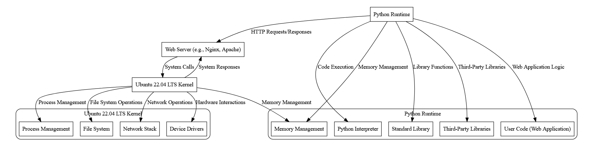

>
    .
        >>
            ..
                >>>
                    ...

rule root = element * { }
rule element = (tag / data) *(element / data)
rule tag = "@" char +
rule data = char +
expression ::= term
             | expression "+" term
             | expression "-" term

term       ::= factor
             | term "*" factor
             | term "/" factor

factor     ::= "(" expression ")"
             | number

number     ::= digit
             | digit number

digit      ::= "0" | "1" | "2" | "3" | "4" | "5" | "6" | "7" | "8" | "9"

Infinite Tape Analogy: The concept of an "infinite tape" or an unbounded sequence of data is reminiscent of the Turing machine model, where the tape serves as both input and memory for the computation. In the context of language models, while the input data may not be truly infinite, the model operates under the assumption of processing potentially limitless sequences of text. 

While tokens represent atomic units of text, embeddings are dense vector representations of those tokens in a continuous vector space.

Runtime Token Space: Your idea of defining boundaries for a "runtime token space" within the infinite tape is intriguing. This could be interpreted as a window or a sliding frame within the larger input space that the model focuses on during inference. By constraining the input to a finite window, the model can efficiently process text data without needing to consider the entire input sequence at once.

Embedding Encoding: These embeddings serve as the input to the neural network. They capture semantic information about the tokens and their context in the input text.

Model Processing: The neural network processes these embeddings to generate predictions or produce text.